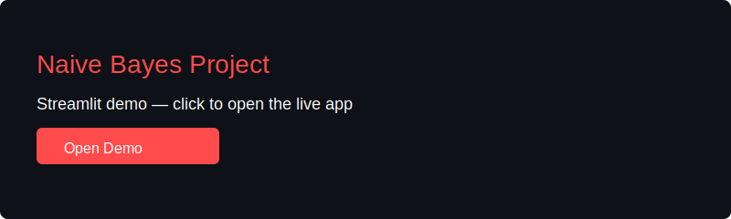

# Naive Bayes Project

[](https://naive-bayes-project.streamlit.app/)

Small demo project for a Naive Bayes classifier using the Iris dataset.

## Project structure

- `app.py` - main entry point to run the project.
- `data/raw/iris.csv` - original dataset.
- `data/cleaned/cleaned_data_20260129_095016.csv` - cleaned dataset used by the project.


## Prerequisites

- Python 3.9+
- Install dependencies:

```bash
pip install -r requirements.txt
```

## Run


Start the Streamlit app with:

```bash
streamlit run app.py
```

If you prefer running the inner script directly, you can also run:

```bash
python app.py
```

## Live Demo

Visit the deployed app:

https://naive-bayes-project.streamlit.app/

Click the image below to open the live demo:

[](https://naive-bayes-project.streamlit.app/)

## Notes

- If you use a virtual environment, activate it before installing dependencies.
- The app uses Streamlit for its UI; open the local URL printed after running `streamlit run`.
- Adjust `app.py` or data file paths if you move files around.
